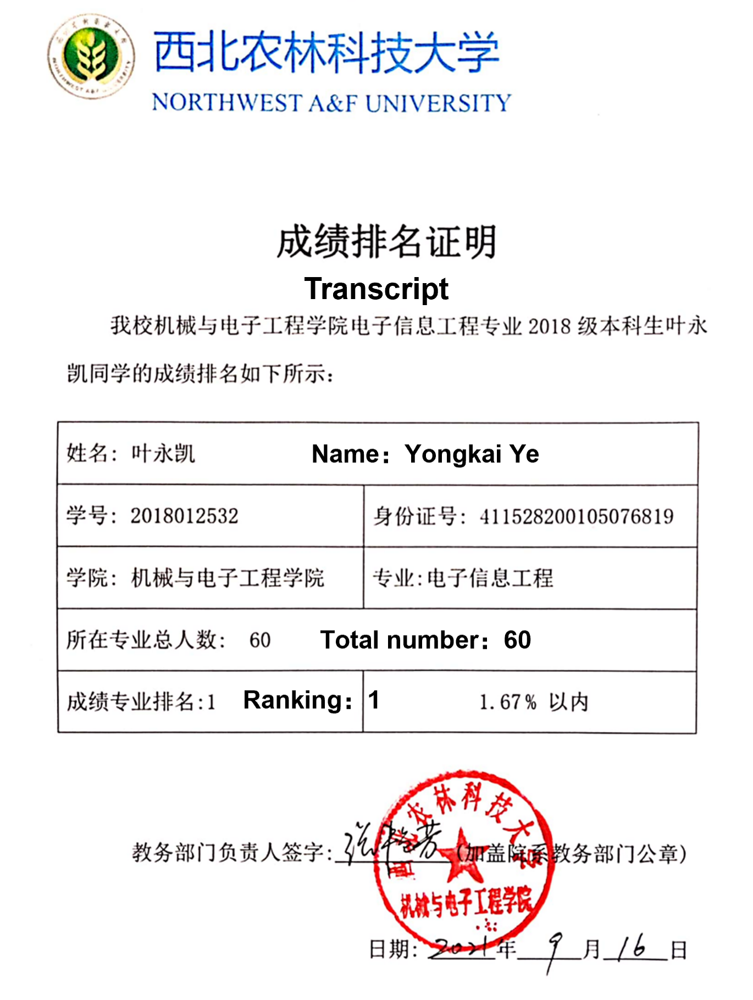

I received my Bachelor’s Degree in Electronics and Information Engineering from the College of Mechanical and Electronics Engineering ([CMEE](https://cmee.nwafu.edu.cn)), Northwest Agriculture & Forest University([NWAFU](https://www.nwafu.edu.cn)) in the summer of 2022. 

During my undergraduate period, I have worked as the monitor of our class and achieved the top, ranking 1/60 (GPA: 3.90/4.00).
{:height="75%" width="75%"}

Interests
======
Electrical control; Development of embedded system; Remote sensing; Machine learning; Deep learning

Graduation project
======
**Title:** Extraction of orchard planting structure in Yangling District based on GEE platform

**Advisor:** [Prof. Jiao Guo](https://cmee.nwsuaf.edu.cn/szdw/gjzcry/318451.htm)

**Object:** Develop an optimal feature extraction algorithm for multi-dimensional remote sensing data and validate its performance in an orchard identification task based on deep-learning methods.

**Abstract:** Planting structures are beneficial to improving  the efficiency of agricultural production. The traditional way of acquiring planting structures is time-consuming and inefficient. Remote sensing is widely used to obtain crop planting information with the advantages of high timeliness, low cost, and wide-range monitoring. This study proposed an approach utilizing information on spectral changes during crop growth based on multi-source data to extract planting structures. A multi-source data was constructed by fusing Sentinel-2 and Gao Fen-1 (GF-1) based on the GEE platform. A high-dimension classification network fusing S-CAE and 3D-CNN, 3D-FSA-CNN, was deployed to conduct the classification. The results using 3D-FSA-CNN, 1D-FSA-CNN, SAE, 1D-CNN, 3D-CNN, DenseNet201, ELM, and RF on the multi-source data indicated that 3D-FSA-CNN obtained optimal classification accuracy with a kappa coefficient and overall accuracy of 0.9684 and 97.68%, respectively. The overall accuracy and Kappa coefficient of the 3D-FSA-CNN network are 11% and 13%, 5% and 6%, 12% and 16%, 15% and 19%, 4% and 5%, and 17% and 23% higher than those of DenseNet201, 3D-CNN, 1D-CNN, SAE, RF, and ELM, respectively. Finally, 3D-FSA-CNN was applied to extract the planting structure for the whole Yangling district, and the overall accuracy and Kappa coefficient were 82% and 76%, respectively.

**Keywords:** GEE; GF-1; Sentinel-2; 3D-FSA-CNN; Remote sensing; Planting structure extraction

