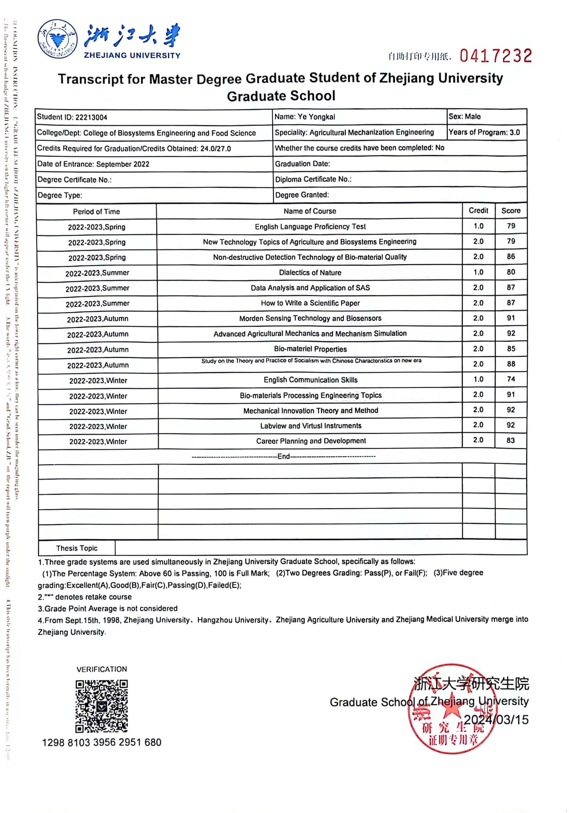

I am currently studying for a Master’s Degree in Agricultural Mechanization Engineering from the College of Biosystems Engineering and Food Science ([CBEFS](https://caefs.zju.edu.cn/)), Zhejiang University ([ZJU](https://www.zju.edu.cn)) since the fall of 2022 and advised by **[Prof. Dongdong Du](https://person.zju.edu.cn/Dudd/)** in the Agri-Soro Lab of CBEFS, ZJU.

I am now working as the person responsible for the safety of our Lab.
My university applies for the two degrees grading system, so there is no ranking certificate. My Transcript is shown here.
{:height="75%" width="75%"}

Research Interests
======
Soft robots; Soft grippers; Soft actuators; Finite element analysis; Fluid-structure interaction analysis; Machine learning

