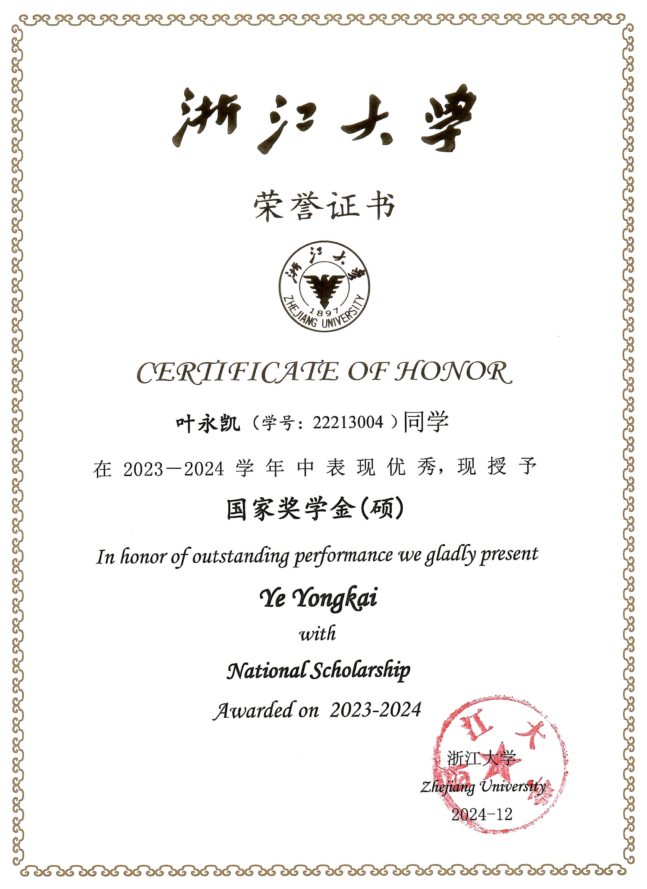
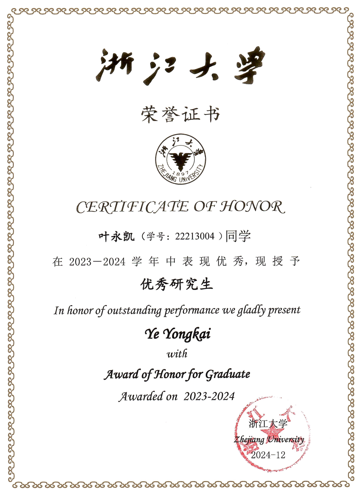
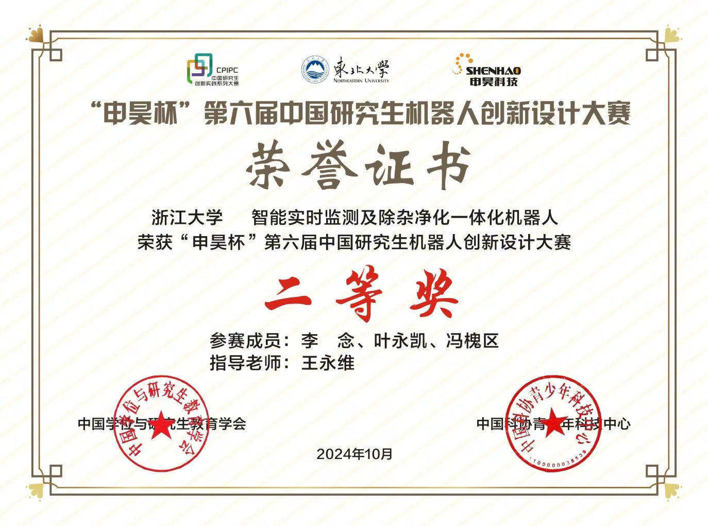
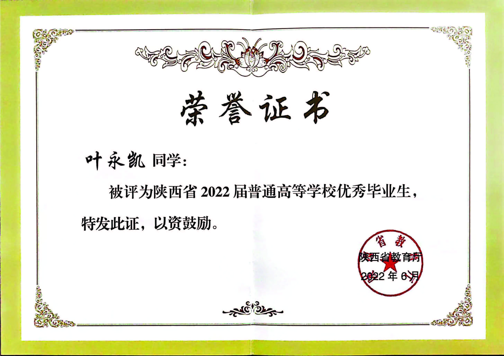
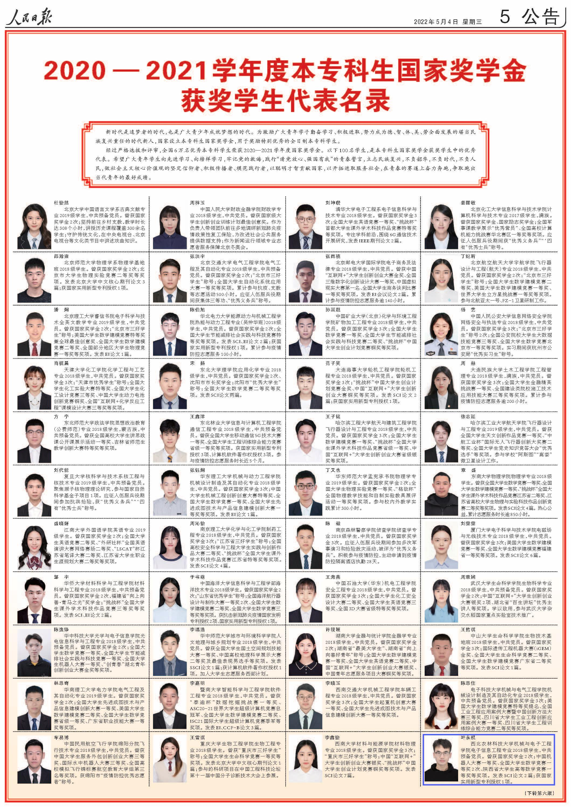
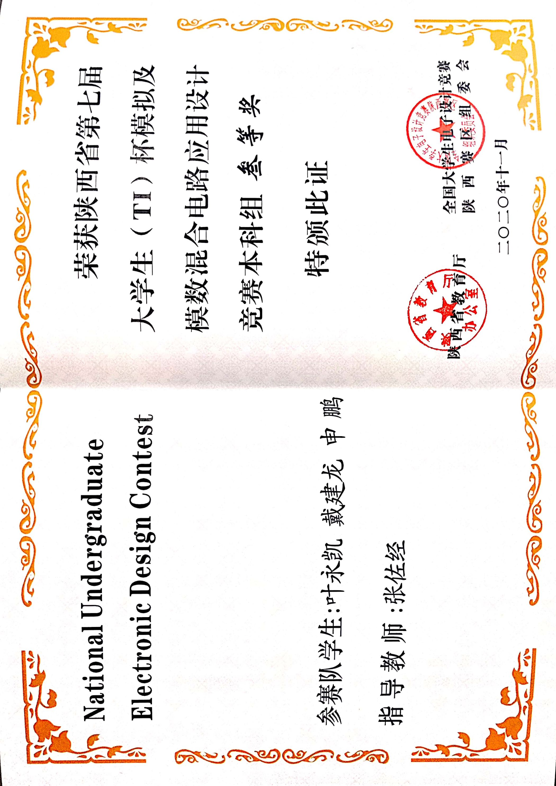
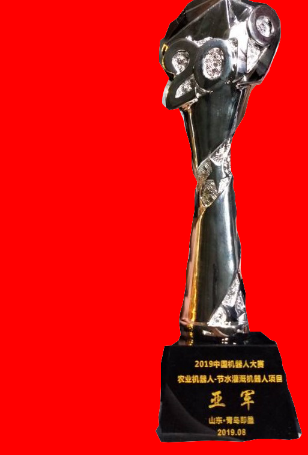



Awards and Achievements
======

2022 -- 2024
---
* National Scholarship (National Award)

{:height="75%" width="75%"}

* Outstanding Postgraduate (Top Intra-school Award)

{:height="75%" width="75%"}

* 6th China Graduate Robot Innovation Design Competition (The Second Prize, National Award)

{:height="75%" width="75%"}

2021 -- 2022
---

* Outstanding Graduates of Shaanxi Province (Provincial Award)

{:height="75%" width="75%"}

* The 2022 Top Ten Graduates Nomination (Top Intra-school Award)

{:height="75%" width="75%"}

* 2022 Outstanding Graduates (Top Intra-school Award)

{:height="75%" width="75%"}

* National Scholarship Student Representative (National Award)

{:height="75%" width="75%"}

* 2022 The Mathematical Contest in Modeling (Honorable Mention, International Award)

{:height="75%" width="75%"}

2020 -- 2021
---
* National Scholarship (National Award)

{:height="75%" width="75%"}

* Outstanding Undergraduate (Top Intra-school Award)

{:height="75%" width="75%"}

* 12th China Undergraduate Mathematical Contest (The Third Prize, National Award)

{:height="75%" width="75%"}

* 7th National Undergraduate Electronic Design Contest (The Third Prize, Provincial Award)

{:height="75%" width="75%"}

* 12th China Undergraduate Mathematical Preliminary Contest (The First Prize, Provincial Award)

{:height="75%" width="75%"}

2019 -- 2020
---
* National Scholarship (National Award)

{:height="75%" width="75%"}

* Outstanding Undergraduate (Top Intra-school Award)

{:height="75%" width="75%"}

* 12th College Students Advanced Mathematics Competition in Shaanxi Province (The First Prize, Provincial Award)

{:height="75%" width="75%"}

* 11th China Undergraduate Mathematical Preliminary Contest (The First Prize, Provincial Award)

{:height="75%" width="75%"}

2018 -- 2019
---
* President Scholarship (Top Intra-school Award)

{:height="75%" width="75%"}

* Outstanding Undergraduate (Top Intra-school Award)

{:height="75%" width="75%"}

* 2019 China Robot Competition (The First Prize, National Award)

{:height="75%" width="75%"}

{:height="75%" width="75%"}

Certification
======
* National Computer Rank Examination two level C language certificate (Excellent)
* National Computer Rank Examination two level C++ language certificate (Good)
