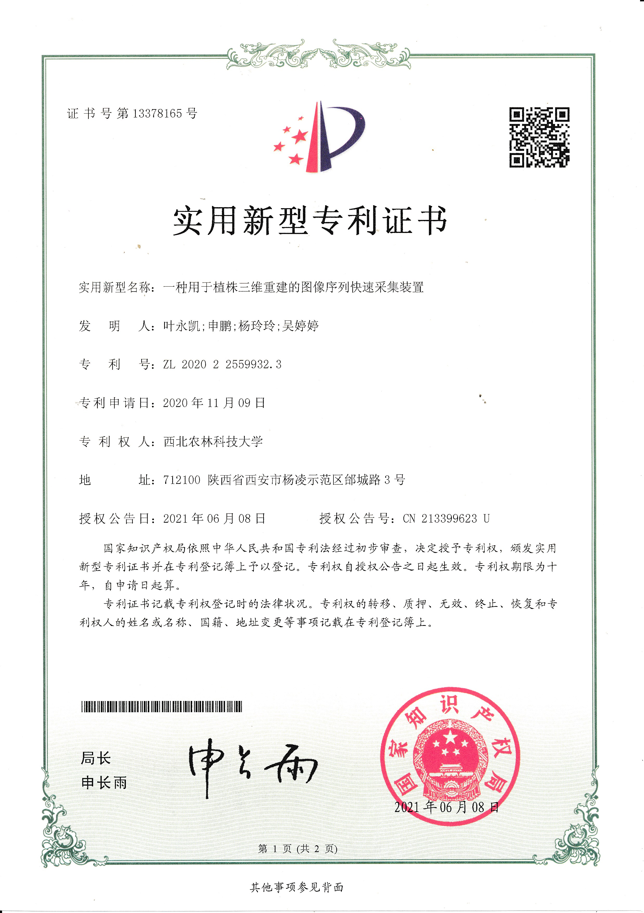



Awards and Achievements
======

2021 -- 2022
---
* 2022 The Mathematical Contest in Modeling (Honorable Mention)
{:height="75%" width="75%"}
* National Scholarship Student Representative

2020 -- 2021
---
* National Scholarship Outstanding Graduate
{:height="75%" width="75%"}
{:height="75%" width="75%"}
* 12th China Undergraduate Mathematical Final Contest (The Third Prize, National Award)
{:height="75%" width="75%"}

2019 -- 2020
---
* National Scholarship Outstanding Graduate
{:height="75%" width="75%"}
{:height="75%" width="75%"}
* 12th China Undergraduate Mathematical Preliminary Contest (The First Prize, Provincial Award)
{:height="75%" width="75%"}

2018 -- 2019
---
* President Scholarship Outstanding Graduate
{:height="75%" width="75%"}
{:height="75%" width="75%"}
* 2019 China Robot Competition (The First Prize)
{:height="75%" width="75%"}
* 11th China Undergraduate Mathematical Preliminary Contest (The First Prize, Provincial Award)
{:height="75%" width="75%"}

Certification
======
* National Computer Rank Examination two level C language certificate (Excellent)
* National Computer Rank Examination two level C++ language certificate (Good)
