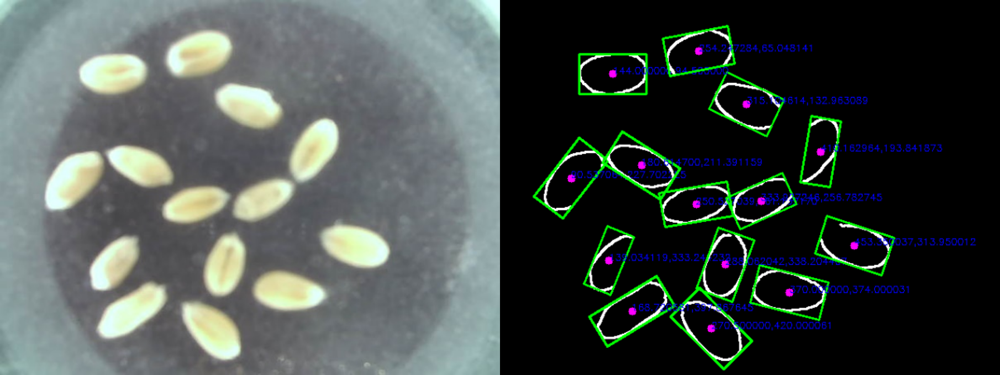
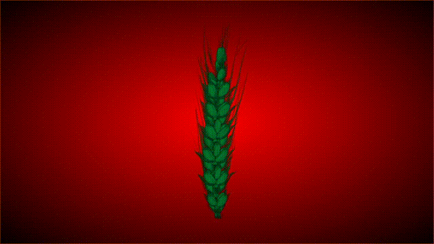

**Object:** Measuring the wheat head traits using 3D construction and multi-view sequence images based on a customized platform.

**Difficulties:** Manual measurements are subjective without enough reliability, and small objects such as wheat seeds make it difficult for the camera to calibrate for accurate results.

**Role:** I was responsible for the construction of the customized platform and the acquisition of multi-view sequence images.

**Advisor:** [Prof. Tingting Wu](https://cmee.nwsuaf.edu.cn/szdw/gjzcry/318499.htm)

**Results:** We realized the 3D construction of wheat heads and seeds and measured their size by a [Point Cloud Library](https://pointclouds.org). We have also been granted a China patent for utility model (Patent number: CN202022559932.3) for the customized platform.

{:height="75%" width="75%"}

Some results are shown as follows.

**Results of customized platform construction**
{:height="75%" width="75%"}

I built a customized frame using aluminum profiles with a three-axis slider and a camera mounted to obtain the multi-view sequence images.

**Results of image processing**
{:height="75%" width="75%"}

I got the position of individual seed based on the [OpenCV library](https://opencv.org/).

**Results of wheat seed reconstruction**
{:height="75%" width="75%"} 

**Results of wheat seed reconstruction**
{:height="75%" width="75%"}

With the help of my partners, multi-view sequence images were employed for 3D reconstruction using  [Marching Cubes algorithm](https://scikit-image.org/docs/stable/auto_examples/edges/plot_marching_cubes.html). The generated 3D point cloud results were processed to remove artifacts and measured by [Point Cloud Library](https://pointclouds.org/) for comparison with actual experiments.
