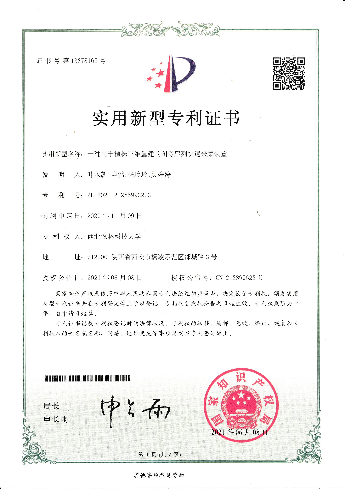

**Object:** Measuring the wheat head traits using 3D construction and multi-view sequence images based on a customized platform.

**Difficulties:** Small objects such as wheat seeds make it difficult for the camera to calibrate.

**Role:** I was responsible for the construction of the customized platform and the acquisition of multi-view sequence images.

**Advisor:** [Prof. Tingting Wu](https://cmee.nwsuaf.edu.cn/szdw/gjzcry/318499.htm)

**Results:** We realized the 3D construction of wheat head and seed and measured the size of them by a [Point Cloud Library](https://pointclouds.org). We have also been granted a China patent (patent number: CN202022559932.3) for the customized platform.

{:height="75%" width="75%"} 

{:height="75%" width="75%"}

{:height="75%" width="75%"}

{:height="75%" width="75%"}
