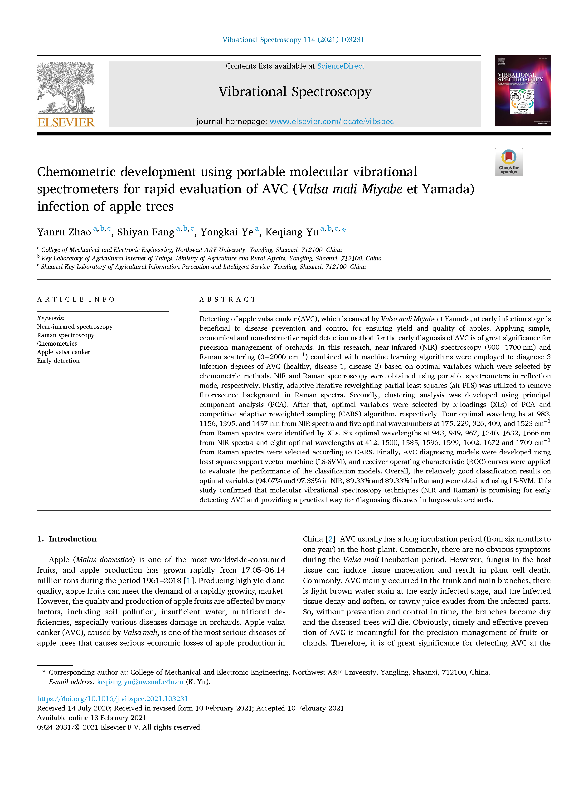

**Object:** Detecting AVC (Valsa mali Miyabe et Yamada) infection of apple trees rapidly in an early stage by combining vibration spectroscopy and chemometrics.

**Difficulties:** Early low-grade infection of apple trees is hardly detected by visual inspection.

**Role:** I was responsible for the acquisition of the apple tree branch samples at three infection stages such as health without infection, low-grade infection, and high-grade infection and the deployment of machine learning algorithms.

**Advisor:** [Prof. Yanru Zhao](https://cmee.nwsuaf.edu.cn/szdw/gjzcry/396312.htm)

**Results:** We developed the method combining  vibration spectroscopy and machine learning and proved the efficiency in the early detection of AVC (Valsa mali Miyabe et Yamada) infection of apple trees. We have also published a SCI paper named ***"[Chemometric development using portable molecular vibrational spectrometers for rapid evaluation of AVC (Valsa mali Miyabe et Yamada) infection of apple trees](https://doi.org/10.1016/j.vibspec.2021.103231)"*** for this research.

{:height="75%" width="75%"} 
