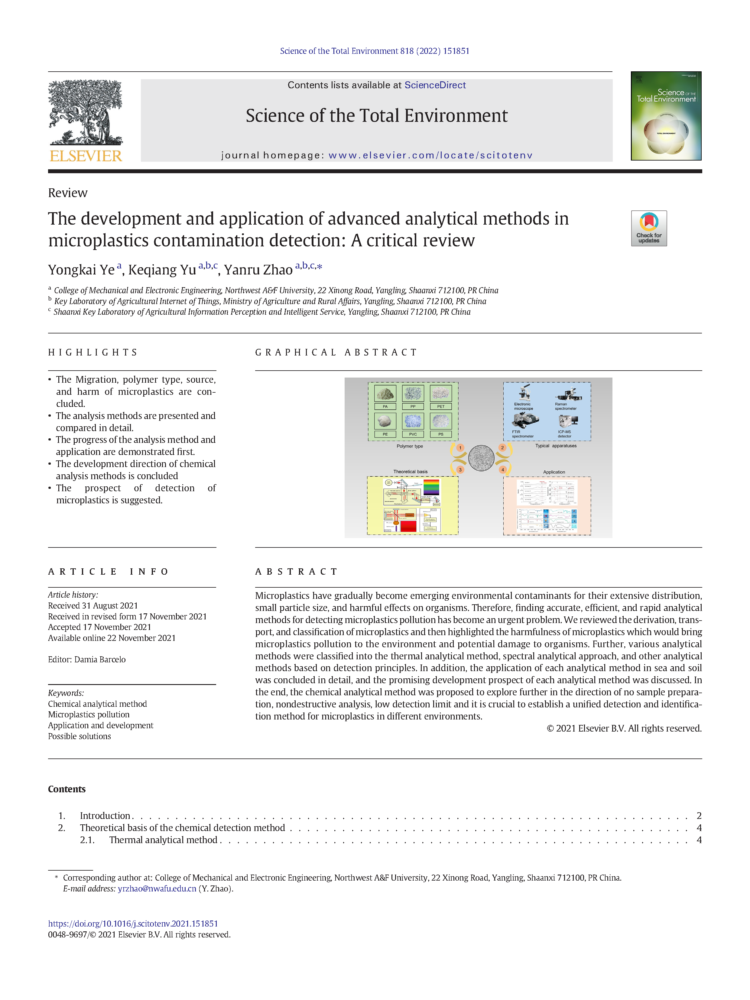

**Object:** Reviewing the development and application of advanced analytical methods in microplastic contamination detection.

**Difficulties:** Early low-grade infection of apple trees is hardly detected by visual inspection.

**Role:** I was responsible for the survey of the literature and the writing and editing of the original draft.

**Advisor:** [Prof. Yanru Zhao](https://cmee.nwsuaf.edu.cn/szdw/gjzcry/396312.htm)

**Results:** We concluded the analytical methods for detecting microplastics and published a SCI paper named ***"[The development and application of advanced analytical methods in microplastics contamination detection: A critical review](https://doi.org/10.1016/j.scitotenv.2021.151851)"*** for this research.

{:height="75%" width="75%"} 
