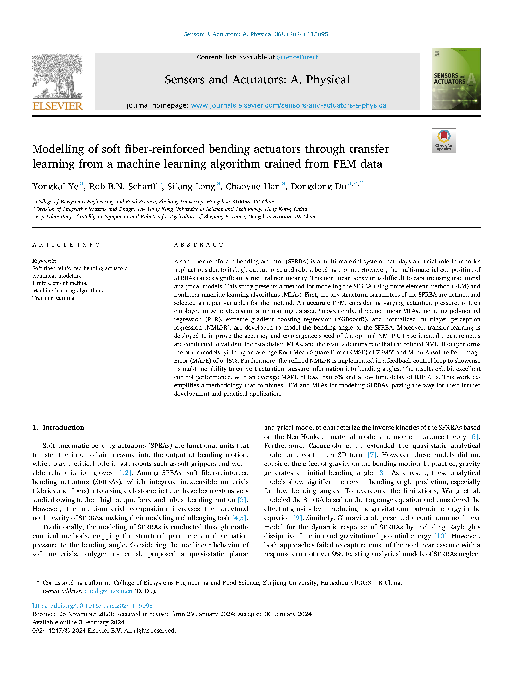

**Object:** Providing a robust method for modeling the bending angle of multi-material SFRBA.

#**Difficulties:** The acquisition of tremendous FEM data pairs and the development of optimal machine learning algorithms.

**Role:** I was with full authority.

**Advisor:** [Prof. Dongdong Du](https://person.zju.edu.cn/Dudd)

**Results:** We highlighted a method for modeling SFRBAs using FEM and machine learning algorithms and published a SCI paper named ***"[Modelling of soft fiber-reinforced bending actuators through transfer learning from a machine learning algorithm trained from FEM data](https://doi.org/10.1016/j.sna.2024.115095)"*** for this research.

{:height="75%" width="75%"} 
<video src="../images/FEMMachineLearningSupplementaryVideo1.mp4" autoplay="true" controls="controls" width="800" height="450">
</video>
