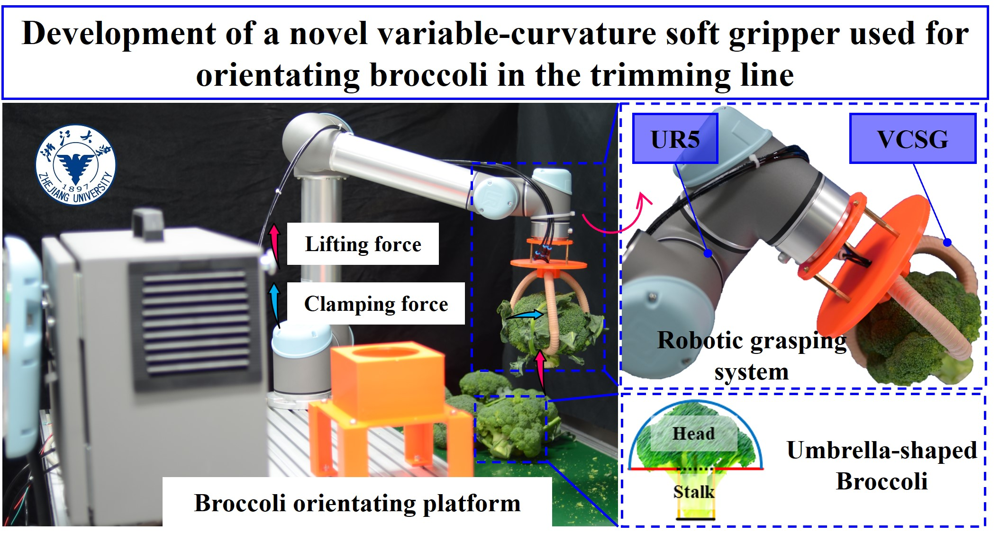

**Object:** Providing a novel pneumatic variable-curvature soft gripper (VCSG) for orientating broccoli.

#**Difficulties:** The design of VCSG.

**Role:** I was with full authority.

**Advisor:** [Prof. Dongdong Du](https://person.zju.edu.cn/Dudd)

**Results:** We presented a novel and efficient variable-curvature soft gripper (VCSG) with the ability to guide the broccoli upright that mainly comprised variable-curvature fiber-reinforced bending actuators (VCFRBAs) and submit a SCI paper named ***"Modelling of soft fiber-reinforced bending actuators through transfer learning from a machine learning algorithm trained from FEM data"*** to the journal ***"Computers and Electronics in Agriculture"*** for this research (Under Review).

{:height="75%" width="75%"} 

