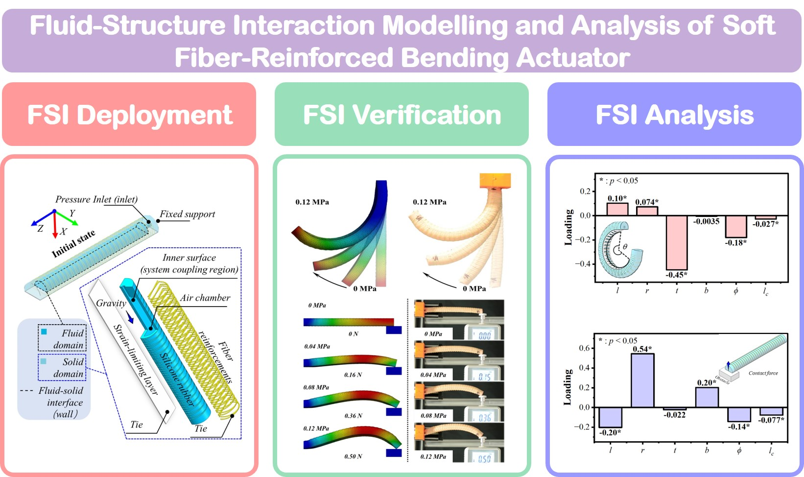

**Object:** Providing an approach for modeling the SFRBAs using fluid-structure interaction (FSI) method, combining computational fluid dynamics (CFD) and nonlinear structural analysis (NSA).

**Difficulties:** The development of FSI method.

**Role:** I was with full authority.

**Advisor:** [Prof. Dongdong Du](https://person.zju.edu.cn/Dudd)

**Results:** We presented a FSI modeling method to describe the nonlinear behaviors of multi-material SFRBAs and submited a SCI paper named ***"Fluid-Structure Interaction Modelling and Analysis of Soft Fiber-Reinforced Bending Actuator"*** to the journal ***"International Journal of Mechanical Science"*** for this research (Under Review).

{:height="75%" width="75%"} 
<!--<video src="../images/FSISupplementaryVideo1.mp4" autoplay="true" controls="controls" width="800" height="450">
</video>-->
