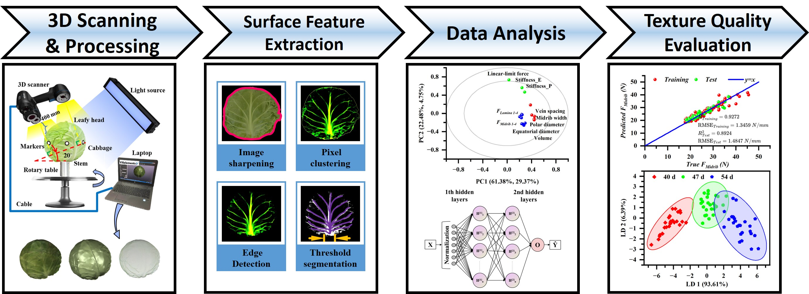

**Object:** Providing a promising solution using 3D scanning technology to nondestructively assess the texture quality of leafy vegetables.

**Difficulties:** The acquisition and processing of 3D scanning data and development of statistics analysis method based on machine learning.

**Role:** I was with full authority.

**Advisor:** [Prof. Dongdong Du](https://person.zju.edu.cn/Dudd)

**Results:** We presented a nondestructive method based on 3D scanning technology for determining the texture quality of leafy vegetables, using the harvested cabbages as experimental samples and published a SCI paper named ***"Nondestructive evaluation of harvested cabbage texture quality using 3D scanning technology"*** to the journal ***"Journal of Food Engineering"*** for this research.

{:height="75%" width="75%"} 

{:height="75%" width="75%"} 
